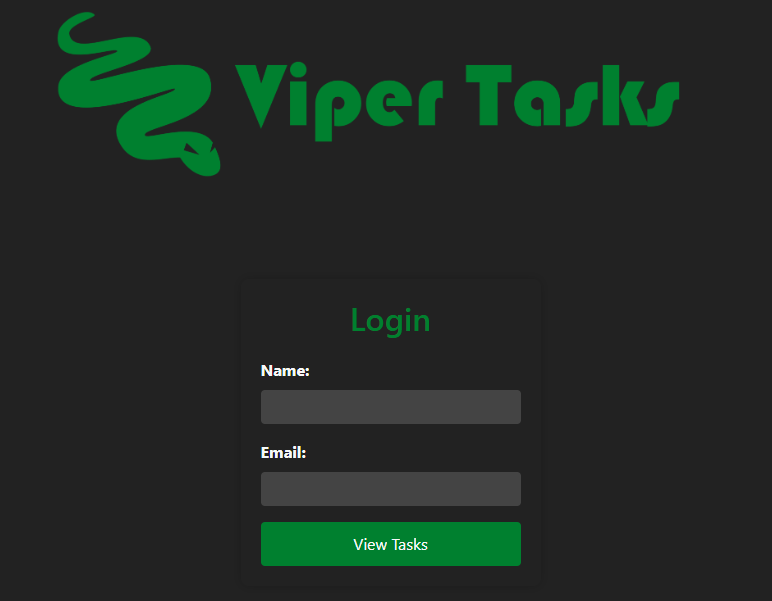
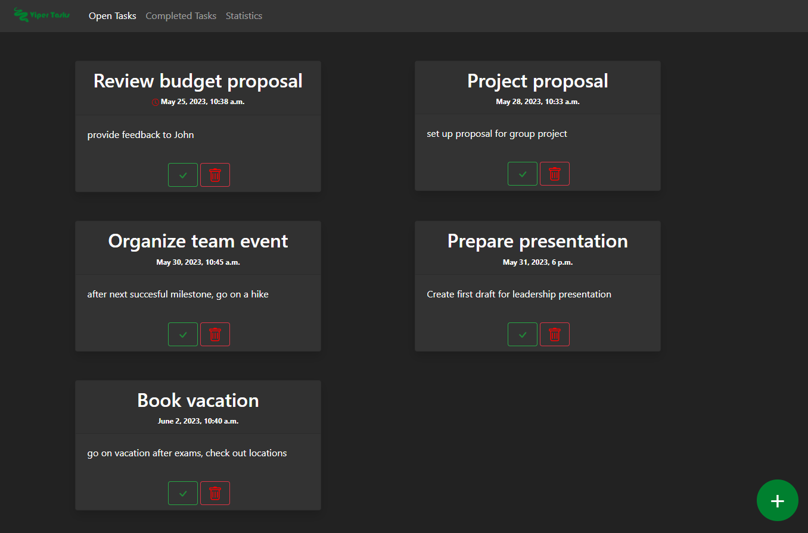
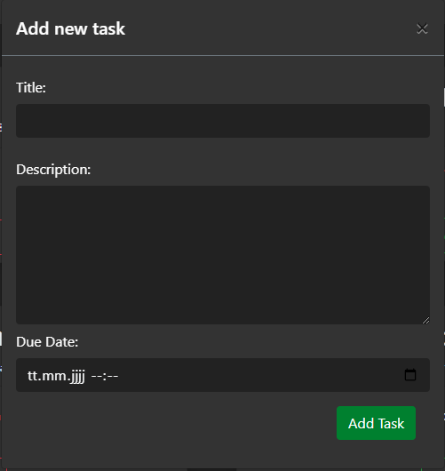
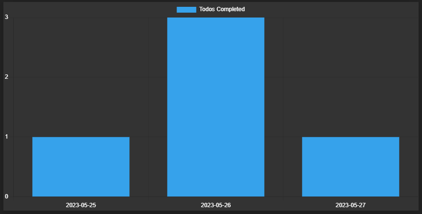

# Viper Tasks (Group Project)

## Demo

The application is deployed at [vipertasks.hawk.li](http://vipertasks.hawk.li) (HTTP only)

For a demo account, use the following credentials (no password required):

```
Username: demo
EMail: demo@demo.com
```

Instructions for running the application locally can be found in the deployment section below.

## Introduction

For our group project, we decided to try a python framework, that could manage a webapplication including persisting data but was still easy to use. We decided to try out [Django](https://www.djangoproject.com/), which is a python framework for web applications. Django is a Model-View-Controller (MVC) framework, which means that the application is split into three parts: The model, which is responsible for the data, the view, which is responsible for the user interface and the controller, which is responsible for the logic. Django also includes a built-in Object-Relational-Mapper (ORM), which means that the application does not have to interact with the database directly, but can use python objects instead. Django also includes a built-in webserver, which makes it easy to run and test the application locally.

## Features

For the use-case we decided to choose a relatively simple one, to be able to experiment with the features django offered and see how they work. We decided to create a simple task management application, where users can create tasks and specify a due date until which they have to be completed.

The tasks are then displayed in a list, where the user can see the task and has the option to complete (or delete) the task. The user can also create new tasks, which are then added to the list. Editing is currently not supported, but could be added in the future.

In addition, we created a little dashboard, where we visualize various statistics, such as
- Number of open/completed tasks
- Number of completed tasks per day
- Completion rate
- Overdue rate
- Average completion time
- Number of tasks created per day

This is achieved by using the [Chart.js](https://www.chartjs.org/) library, which is a javascript library for creating charts. The data is retrieved from the backend using AJAX requests.

Sample screenshots are shown below:

Login:



List of open tasks:



Adding a task:




Creation date statistics:


Completions per day:



## Code

The code for the application can be found in the `vipertasks/tasks` directory. The `static` directory contains the static files (e.g. css, javascript, images) and the `templates` directory contains the html templates. 
The app was styled using bootstrap, which is a css framework. The `static` directory also contains the javascript code for the application, which uses chart.js to create charts and AJAX requests to retrieve the data from the backend. The `views.py` file contains the logic for the application, while the `models.py` file contains the models for the application. The `urls.py` file contains the url mappings for the application.


## Learnings

During the development of the application, we learned a lot about the django framework and how it works. We also learned how to use the built-in ORM to interact with the database. Overall we were very satisfied with the framework, as it was easy to use and we were able to create a working application in a relatively short amount of time. While we intentionally tried to keep things simple (e.g. no authentication), we were still able to create a working application with a nice user interface. Additionally, we realized how much work can go into a "simple" application if it has to cover all possible use-cases. We were really impressed by django's built-in features, such as the admin interface and how relatively easy it was to query the database to create the statistics.

## Possible Improvements

While the application is working, there are still some things that could be improved. For example, the application currently does not support editing tasks, which could be added in the future. Additionally, the application currently does not support authentication, which means that everyone can see all tasks. This could be improved by adding authentication and only allowing users to see and edit their own tasks. Another improvement could be to add a notification system, which notifies the user when a task is due soon or overdue. We could also include a calendar view, or different filtering options. Another improvement would be to make the design more responsive, so that it also works on mobile devices. Additionally, we could add different categories to the tasks, or add the option to add subtasks to a task. Finally, the option to share and assign tasks to other users could be added.

## Deployment

To deploy the application locally, python 3.9 or higher is required. The application was developed using python 3.9.1, but should also work with newer versions. To install the required dependencies, run the following command in the root directory of the project:

```
pip install -r requirements.txt
```

To start the application, run the following commands:

```
cd vipertasks
python manage.py migrate
```

After running the migrations for the first time, django automatically creates the database. 
After that, the application can be started using the command:

```
python manage.py runserver
```

The application is now available at [localhost:8000](http://localhost:8000).

## Deployment via docker

To deploy the application via docker, docker and docker-compose are required. To start the application, run the following commands:

```
docker-compose build
docker-compose up
```

This runs the application in a docker container and exposes port 80. The application is now available at [localhost](http://localhost). To deploy this on a webserver, the domain name has to be added to the `ALLOWED_HOSTS` list in the `/vipertasks/vipertasks/settings.py` file.

